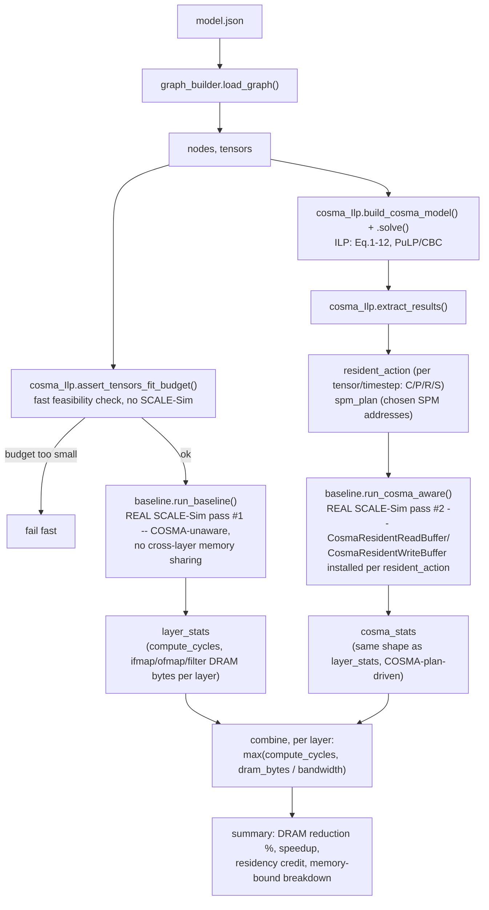
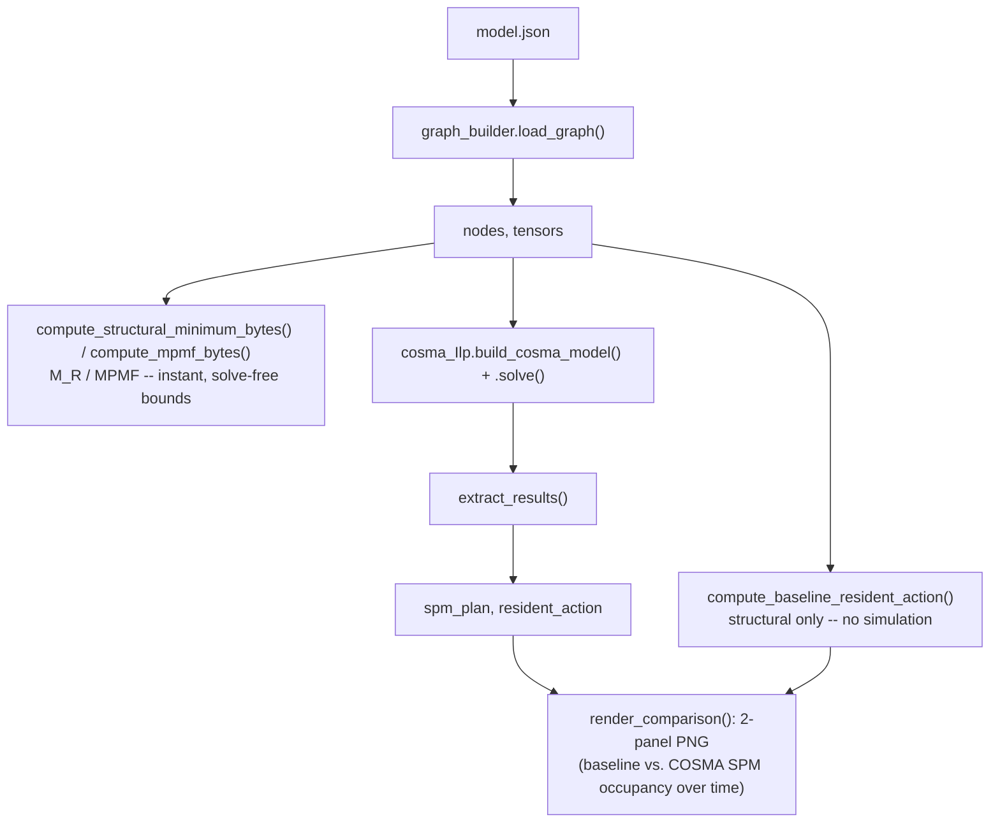

# Pipeline

How this project actually works, end to end. For *why* each design choice
was made, see `ITERATION_HISTORY.md`; for what's built vs. still missing,
see `STATUS.md`. This file is just the mechanics: what runs, in what
order, and what depends on what.

## The idea in one paragraph

COSMA (arXiv:2311.18246) is an ILP that decides, per tensor per timestep,
whether to keep it resident in a limited scratchpad (SPM), spill it to
DRAM, or retrieve it back — to minimize non-compulsory DRAM traffic. The
paper's own evaluation is purely analytical (its objective value, no
simulator). We went further: we plug COSMA's actual decisions into
SCALE-Sim's real, cycle-accurate engine, so the claimed DRAM savings are
*genuinely simulated*, not just asserted — and so the result is a real
cycle count / speedup, not just a bytes-moved percentage.

## Directory layout

```
cosma/
├── run_cosma.py         entry point -- full pipeline (Pipeline A)
├── run_experiments.py   entry point -- batch sweep, wraps run_cosma()
├── visualize_spm.py     entry point -- fast diagnostic (Pipeline B)
├── model.json, toy_*.json          input graphs (one real, two synthetic)
├── helpers/              library modules -- only ever imported, never run directly
│   ├── graph_builder.py       model.json -> nodes/tensors
│   ├── topology_builder.py    model.json -> SCALE-Sim topology CSV
│   ├── baseline.py            real SCALE-Sim driver
│   ├── cosma_Ilp.py           the ILP itself
│   └── model_resolver.py      .tflite -> model.json auto-export + cache
├── docs/                  this file, ITERATION_HISTORY.md, STATUS.md, cosma_integration_plan.md
├── _exported/, results/, spm_plots/, logs/   generated/cached, gitignored
```

Run everything from `cosma/` itself (not `cosma/docs/`) — the three entry
points are the only files meant to be invoked directly; everything under
`helpers/` is imported by them (`from helpers import graph_builder`, etc.)
and isn't meant to be run on its own outside of quick debugging (see
`ITERATION_HISTORY.md` §3 for those standalone debug commands).

There are two separate pipelines in this repo: the full one
(`run_cosma.py`), which is slow but produces real, SCALE-Sim-verified
cycle/DRAM numbers; and a fast one (`visualize_spm.py`), which never
touches SCALE-Sim at all and is for inspecting/debugging the ILP's own
decisions directly.

## Pipeline A — `run_cosma.py` (the real, SCALE-Sim-verified path)



**Steps, in the order they execute** (`run_cosma.py`'s `run_cosma()`):

1. **`graph_builder.load_graph(model.json)`** — parse into `nodes` (layer id → op + input/output tensor ids) and `tensors` (tensor id → size in bytes, producer layer, consumer layers). No SCALE-Sim, instant.
2. **`cosma_Ilp.assert_tensors_fit_budget()`** — one pass over all tensors; fail immediately if any single one exceeds the budget, before paying for any SCALE-Sim run.
3. **Resolve DRAM bandwidth** — `_default_bandwidth_words_per_cycle()`. In `CALC` bandwidth mode (what we use), SCALE-Sim has no single DRAM bandwidth number, so this reuses the array's own width as the assumed bandwidth (a real consequence of this: array size and assumed bandwidth move together — see `ITERATION_HISTORY.md` item 21).
4. **`baseline.run_baseline()`** — **real SCALE-Sim pass #1**, the slow one. Every conv-like layer run through actual SCALE-Sim with its own default (COSMA-unaware) buffers — nothing ever kept resident across layers. Doesn't depend on the budget, so a caller sweeping several budgets (`run_experiments.py`) computes this once and reuses it.
5. **`cosma_Ilp.build_cosma_model()` + `.solve()`** — no SCALE-Sim, pure optimization. Builds the `P`/`S`/`R`/`L` variables and Eq.1–11 constraints for this specific budget, solves with PuLP/CBC minimizing Eq.12 (spill+retrieve bytes). Raises if the solve doesn't reach `Optimal`.
6. **`cosma_Ilp.extract_results()`** — reads the solved variables into `resident_action`: for every `(tensor, timestep)`, which of Create/Preserve/Spill/Retrieve happened. This *is* COSMA's plan.
7. **`baseline.run_cosma_aware()`** — **real SCALE-Sim pass #2**, also slow, and re-run every time (unlike step 4) since it depends on the budget-specific plan. Re-simulates every layer with `CosmaResidentReadBuffer`/`CosmaResidentWriteBuffer` installed, so a `'P'`-resident tensor's fetch is genuinely skipped by the engine, and every layer's own output genuinely skips its drain-to-DRAM.
8. **Combine, per layer** — for each layer: figure out if a retrieved tensor has a real SCALE-Sim number to draw on (conv-like layers only) or needs the idealized fallback (spills, and retrieves consumed by non-conv layers); accumulate real residency credit (`baseline − cosma` DRAM bytes); compute `max(compute_cycles, dram_bytes/bandwidth)` for both scenarios (this is also where the per-layer memory-bound-vs-compute-bound breakdown is recorded).
9. **Final numbers** — `dram_traffic_reduction_pct`, `speedup`, printed if `verbose`.
10. **Save the SPM occupancy diagram** — on by default from the CLI (`--no-plot` to skip). Calls `visualize_spm.compute_baseline_resident_action()` + `render_comparison()` directly, reusing the `result` from step 6 rather than re-solving the ILP a second time.

Steps 1–3 and 5–6 are fast (no SCALE-Sim). Steps 4 and 7 are the slow, real simulation passes — the ones that take minutes on ResNet-50/Inception-V3-sized models.

## Pipeline B — `visualize_spm.py` (fast, no SCALE-Sim at all)



Same graph-loading and ILP-solving steps as Pipeline A (steps 1, 5, 6
above) — but stops there. Never calls `baseline.run_baseline()` or
`run_cosma_aware()`, so it's fast (milliseconds to a few seconds) even on
models where Pipeline A takes minutes. Used for: `--bounds-only` (instant
feasibility range), and the baseline-vs-COSMA occupancy diagram, which
shows *what the ILP decided* (placement, spill/retrieve) directly —
something Pipeline A's aggregate byte/cycle totals don't expose on their
own.

**What Pipeline B's baseline panel is not**: it doesn't run SCALE-Sim's
default buffers at all — it derives the "no COSMA" picture structurally,
straight from `producer_layer`/`consumer_layers` (a tensor is resident
only at creation, refetched at every consuming timestep, since that's
what the unmodified engine does regardless of budget). Pipeline A's
`baseline.run_baseline()` is the actual simulated version of the same
regime.

## Which one answers which question

| Question | Use |
|---|---|
| "Is this budget even worth trying?" | Pipeline B, `--bounds-only` |
| "What did COSMA actually decide — which tensor, where, when evicted?" | Pipeline B, the diagram |
| "How many real DRAM bytes / cycles does this save?" | Pipeline A |
| "Does the DRAM saving actually translate into a speedup on this hardware?" | Pipeline A's memory-bound breakdown (`ITERATION_HISTORY.md` item 21) |
| "Sweep many models/budgets and save a results table" | `run_experiments.py` (wraps Pipeline A, reusing step 4 across budgets) |
